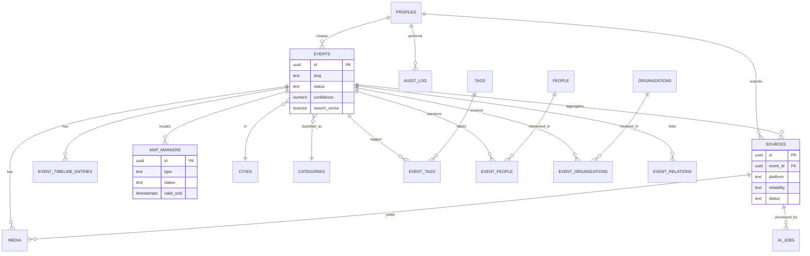
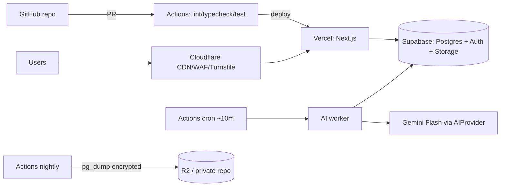

# Flamingo Revolution — Event Intelligence Platform
## Software Architecture (v2)

> Status: **awaiting approval to begin M0**. No application code exists yet. This is the technical source of truth. Companion docs: `ROADMAP.md`, `DECISIONS.md`, `CONSTITUTION.md`, `CONTENT_POLICY.md`, `THREAT_MODEL.md`, `CONTRIBUTING.md`.
>
> **v2 changes from v1:** Prisma → Supabase JS client + RLS; embeddings/semantic search deferred (Postgres Full-Text Search only in v1); AI accessed only through an `AIProvider` interface; source-reliability model added; feature-based folder layout; docs + `.cursor/rules` formalized. See `DECISIONS.md` (ADR-0001…0010) for the rationale of each.

---

## 0. Constitution & the framing decisions

Every decision in this document serves the **Project Constitution** (`CONSTITUTION.md`). The load-bearing invariants:

1. **Events are the primary entity.** Sources are raw material folded into canonical events.
2. **AI assists, humans publish.** The pipeline only ever produces drafts. Nothing AI-generated goes public without a moderator.
3. **The platform must work with AI switched off.** M0–M2 deliver a fully usable, human-run archive before any AI exists. If Gemini disappears tomorrow, the site still runs.
4. **References, not copies.** We store URLs + metadata + our own summaries, not third-party copyrighted media.
5. **Security and contributor privacy over convenience.** This is an active anti-government movement with documented police violence; the threat model is real.
6. **Fewer moving parts.** One Next.js app, one Supabase project, one scheduled worker. Complexity is added only when a concrete limit is hit.

Three framing decisions carried over from v1 and still hold:

- **A. "AI-powered" vs. near-zero budget** → resolved by human-gated, low-volume AI that fits a free LLM tier.
- **B. Dangerous dual-use features** (live police-presence mapping, auto-naming individuals) → gated, verified, expiring, and in the case of live police positions **deferred from v1** (ADR-0009).
- **C. Vercel Hobby = non-commercial + hard caps** → stack kept portable to Cloudflare Pages; worker never depends on Vercel cron (ADR-0007, ADR-0010).

---

## 1. System architecture

### 1.1 Components

| Component | Responsibility | Runs on |
|---|---|---|
| **Web app** (Next.js App Router, TS) | Public site, dashboards, server actions, minimal API routes | Vercel (fallback: Cloudflare Pages) |
| **Postgres** | Relational data, Full-Text Search, RLS, job-queue table | Supabase |
| **Data access** | **Supabase JS client** (server + browser), typed via generated types | in-app |
| **Schema & migrations** | **Supabase SQL migrations** (CLI, versioned `.sql`) | Supabase CLI |
| **Auth** | Sessions, magic link, OAuth, role claim via Auth Hook | Supabase Auth |
| **Object storage** | First-party uploads only (EXIF-stripped) | Supabase Storage (fallback: R2) |
| **AI worker** | Async pipeline; talks to the app only through `AIProvider` | GitHub Actions (cron) |
| **LLM** | First `AIProvider` implementation | Google Gemini Flash (free tier) |
| **CDN / WAF / captcha** | Caching, DDoS, DNS, Turnstile | Cloudflare |
| **CI / backups** | Lint/typecheck/test, deploy, nightly `pg_dump`, keep-alive | GitHub Actions |

**What we removed vs. v1:** Prisma (ORM), pgvector / embeddings / semantic search (deferred), and any direct LLM calls from application code.

### 1.2 Read lifecycle
```
Visitor → Cloudflare (cache?) → Vercel edge → Next.js RSC
   → Supabase server client (anon key + RLS: "published is public") → Postgres
   → render → cache at CDN
```
### 1.3 Write / ingestion lifecycle
```
Submit source (Server Action, Turnstile-verified) → sources row (status=pending)
GitHub Actions worker (~10 min) → claim batch (service role) → AIProvider pipeline
   → write draft event + entities (status=needs_review)
Moderator dashboard → edit / set reliability / merge / approve
   → status=published → revalidate tags → CDN purge
```

---

## 2. Feature-based folder structure

The project is organized by **feature**, not by technical layer. Each feature is a self-contained vertical slice that owns its UI, logic, validation, data access, and types, and exposes a small public interface via its `index.ts`. A feature can later be rewritten, disabled, or open-sourced on its own.

```
flamingo/
├─ docs/                      # ARCHITECTURE, ROADMAP, DECISIONS, CONSTITUTION, CONTENT_POLICY, THREAT_MODEL, CONTRIBUTING
├─ .cursor/rules/             # *.mdc rules (see §12)
├─ supabase/
│  ├─ config.toml
│  ├─ migrations/             # NNNN_description.sql (source of truth for schema)
│  └─ seed.sql                # sample data for local + preview
├─ scripts/
│  ├─ worker/run.ts           # thin entrypoint; imports features/ai; run by GitHub Actions
│  └─ backup.ts               # pg_dump → encrypt → upload
├─ src/
│  ├─ app/
│  │  ├─ (public)/            # home, events/[slug], timeline, map, media, search
│  │  ├─ (auth)/              # sign-in, callback
│  │  ├─ (dashboard)/         # moderator/admin — role-gated layout
│  │  ├─ api/                 # og/[slug], rss, sitemap, robots, worker/callback (secret)
│  │  └─ layout.tsx
│  ├─ features/               # ← the heart of the codebase
│  │  ├─ auth/
│  │  ├─ events/
│  │  ├─ timeline/
│  │  ├─ sources/
│  │  ├─ media/
│  │  ├─ map/
│  │  ├─ search/
│  │  ├─ moderation/
│  │  └─ ai/                  # AIProvider interface + GeminiFlashProvider + pipeline steps
│  ├─ shared/                 # cross-feature primitives only
│  │  ├─ supabase/{server.ts,client.ts,service.ts}
│  │  ├─ auth/authorize.ts    # readable authorization helper (RLS is the real boundary)
│  │  ├─ ui/                  # shadcn/ui primitives, layout, theme
│  │  ├─ validation/          # shared Zod helpers
│  │  ├─ i18n/                # sq (primary) + en
│  │  ├─ images.ts            # sharp: validate + strip EXIF + re-encode
│  │  ├─ ratelimit.ts, turnstile.ts, dates.ts (Europe/Tirane)
│  ├─ types/database.ts       # generated: `supabase gen types typescript`
│  └─ styles/
├─ .github/workflows/{ci.yml, worker.yml, backup.yml}
├─ .env.example
└─ eslint.config.mjs / .prettierrc / tsconfig.json (strict)
```

**Each `features/<name>/` contains:**
```
components/     UI (client + server components)
queries.ts      reads via Supabase server client (RLS-scoped)
actions.ts      mutations as Server Actions (authorize → validate → mutate → audit → revalidate)
schema.ts       Zod schemas (validation + inferred types)
types.ts        feature types (re-export slices of generated DB types)
utils.ts        pure helpers
index.ts        the feature's public surface (what other features may import)
```
**Rule:** features talk to each other only through `index.ts`, never by reaching into internal files. Business logic never leaks into `app/` route files — those just compose features.

---

## 3. Database schema

Postgres on Supabase. Schema lives in versioned **SQL migrations** under `supabase/migrations/`. TypeScript types are **generated** from the live schema (`types/database.ts`) — the database is the source of truth for types, so there is no ORM model to drift.

Conventions: `uuid` PKs (`gen_random_uuid()`), `timestamptz` in UTC (app tz `Europe/Tirane`), `snake_case`, Postgres enums for closed sets, join tables for M:N, RLS enabled on every table.

### 3.1 Tables (columns that matter)

**profiles** (1:1 with `auth.users`, created by trigger) — `id (PK=auth.uid)`, `username`, `display_name`, `avatar_url`, `role ∈ {user, moderator, admin}` (default `user`), `created_at`.

**events** (aggregate root) — `id`, `slug (unique)`, `status ∈ {draft, needs_review, published, rejected, archived}`, `title`, `ai_summary`, `editor_summary`, `summary_lang`, `event_date`, `starts_at`, `city_id → cities`, `lat`, `lng`, `category_id → categories`, `confidence (numeric 0–1)`, `is_featured`, `is_pinned`, `view_count`, `created_by`, `published_at`, `created_at`, `updated_at`, `search_document (text)`, `search_vector (tsvector, generated from search_document)`.
> **Embedding-ready (ADR-0002):** adding semantic search later = enable `pgvector` + `ALTER TABLE events ADD COLUMN embedding vector(768)` + backfill. Purely additive; no redesign. No vector column ships in v1.

**sources** (many → one event) — `id`, `event_id (nullable)`, `url`, `platform ∈ {instagram, facebook, youtube, tiktok, news, photo, video, pdf, witness, other}`, **`reliability ∈ {government, major_news, verified_journalist, verified_organizer, citizen_video, citizen_photo, anonymous, unknown}`**, `submitted_by (nullable = guest)`, `status ∈ {pending, processing, needs_review, approved, rejected, duplicate, error}`, `raw_metadata (jsonb)`, `ai_title`, `ai_summary`, `ai_tags (text[])`, `ai_category`, `detected_city`, `detected_date`, `is_relevant`, `created_at`, `processed_at`. **No submitter IP stored** (§10).

**cities** — `id`, `slug`, `name_sq`, `name_en`, `lat`, `lng`, `country (default 'AL')`.
**categories** — `id`, `slug`, `name_sq`, `name_en`, `description`.
**tags** — `id`, `slug`, `name`. **event_tags** — (`event_id`, `tag_id`).
**people** *(privacy-sensitive, §10)* — `id`, `slug`, `display_name`, `role_description`, `kind ∈ {public_official, organization_rep, public_figure, private}`, `visibility ∈ {public, restricted, redacted}` (default `redacted` when `kind=private`), `is_verified`. **event_people** — (`event_id`, `person_id`), `mention_context`.
**organizations** — `id`, `slug`, `name`, `type ∈ {ngo, party, gov, police, media, business, other}`, `website`, `is_verified`. **event_organizations** — (`event_id`, `organization_id`), `role`.
**media** — `id`, `event_id`, `source_id (nullable)`, `type ∈ {photo, video, document}`, `storage ∈ {external, supabase}`, `external_url`, `storage_path`, `thumbnail_path`, `caption`, `credit`, `license`, `exif_stripped`, `width`, `height`.
**event_timeline_entries** — `id`, `event_id`, `occurred_at`, `title`, `description`, `source_id (nullable)`, `created_by`.
**event_relations** — (`event_id`, `related_event_id`), `relation_type ∈ {duplicate, related, follow_up, part_of}`.
**map_markers** *(dual-use, §10)* — `id`, `event_id (nullable)`, `type ∈ {protest, roadblock, medical_aid, water, meeting_point, police_presence, press}`, `lat`, `lng`, `label`, `status ∈ {unverified, active, expired}`, `valid_from`, `valid_until`, `verified_by`. *`police_presence` deferred from v1 (ADR-0009); sensitive types default `unverified` and auto-expire.*
**announcements** — `id`, `title`, `body`, `is_pinned`, `created_by`, `published_at`.
**ai_jobs** — `id`, `source_id`, `status`, `attempts`, `steps (jsonb)`, `error`, `started_at`, `finished_at`.
**audit_log** — `id`, `actor_id`, `action`, `entity_type`, `entity_id`, `before (jsonb)`, `after (jsonb)`, `reason`, `created_at`.

### 3.2 Full-Text Search (v1 search engine)

Search must cover **title, summary, tags, city, category, organizations**. Because those live across tables, each event carries a denormalized `search_document` text column, kept current by a trigger that fires when the event or its related tags/city/category/orgs change. A generated `search_vector tsvector` (with `setweight`: title = A, summary = B, tags/entities = C) is indexed with `GIN`. Autocomplete uses `pg_trgm` on names.

No external search service. No embeddings. This is the entire search stack for v1.

### 3.3 The queue is a column
`sources.status = 'pending'` **is** the job queue; the worker claims batches with `... FOR UPDATE SKIP LOCKED`. No broker. Upgrade path: Supabase `pgmq`, no data-model change.

---

## 4. Entity relationship diagram



---

## 5. Data-access & API architecture

**Default to the framework; add endpoints only when unavoidable.**

- **Reads → RSC + Supabase server client**, statically generated / ISR. Public pages read with the anon key; RLS enforces "published is public." `revalidateTag('event:'+slug)` fires on publish.
- **Mutations → Server Actions** using the request-scoped server client (carries the user's JWT, so RLS + role claim apply). Pattern: `authorize()` → Zod-parse → mutate → `audit()` → `revalidate()`.
- **Service-role client** (`shared/supabase/service.ts`) bypasses RLS and is used **only** in the worker and a few server-only admin operations. It is never imported into client code (enforced by a `.cursor` rule and lint boundary).
- **Route Handlers** only for `og/[slug]`, `rss`, `sitemap`, `robots`, and an optional secret-guarded `worker/callback`.

Generated types (`types/database.ts`) flow into `queries.ts`/`actions.ts`, so query results are fully typed without an ORM.

---

## 6. Authentication & authorization

**Auth = Supabase Auth**: passwordless magic link + optional Google OAuth, sessions via `@supabase/ssr` cookies, refreshed in `middleware.ts`. A trigger creates the `profiles` row (`role='user'`). `moderator`/`admin` granted by an admin (audited).

**Authorization is enforced by Row Level Security (RLS) at the database** — this is the primary boundary now that we use the Supabase client (ADR-0001). To make role checks cheap and per-request, a **Supabase Auth Hook injects `user_role` into the JWT**, so policies read `auth.jwt()->>'user_role'` without a per-row subquery. `shared/auth/authorize.ts` mirrors these rules in the app layer for readable guards and UX, but the DB is the enforcement boundary; the app-layer check is defense-in-depth, not the gate.

**Guest submissions are intentionally allowed** (Turnstile + rate limit) to protect contributor anonymity and lower the barrier to citizen reporting.

| Capability | Guest | User | Moderator | Admin |
|---|---|---|---|---|
| Read published | ✅ | ✅ | ✅ | ✅ |
| Submit source | ✅ (Turnstile) | ✅ | ✅ | ✅ |
| See queue / drafts | ❌ | ❌ | ✅ | ✅ |
| Approve / reject / merge / edit | ❌ | ❌ | ✅ | ✅ |
| Set reliability / confidence / feature / pin | ❌ | ❌ | ✅ | ✅ |
| Verify sensitive markers | ❌ | ❌ | ✅ | ✅ |
| Manage roles / categories / delete | ❌ | ❌ | ❌ | ✅ |

---

## 7. AI processing pipeline (via `AIProvider`)

Application code **never calls Gemini directly** (ADR-0003). All AI goes through one interface:

```ts
interface AIProvider {
  generateSummary(input): Promise<Summary>          // sq + en
  extractMetadata(input): Promise<EventMetadata>    // city, date, category, orgs, people
  generateTags(input): Promise<string[]>
  detectDuplicates(candidate, against): Promise<DuplicateVerdict>
  clusterEvents(items): Promise<Cluster[]>
  translate(text, from, to): Promise<string>
  summarizeDaily(events): Promise<DailyBrief>
}
```

First implementation: `GeminiFlashProvider` (JSON mode, every output **Zod-validated**; malformed = retry once then flag `error`). Swapping providers (paid Gemini tier for data-privacy, a self-hosted open model, or another vendor) is a class swap behind the interface — no change to features (Constitution #10; ADR-0003).

**Worker** (`scripts/worker/run.ts`, GitHub Actions ~10 min, service role) — claims a small batch (well under Gemini's ~1,500 RPD / 15–30 RPM free limits) and doubles as the Supabase keep-alive:
```
claim → fetch/extract (oEmbed / OG / PDF text / upload text; never copy copyrighted bytes)
      → relevance gate → extractMetadata + generateSummary + generateTags
      → detectDuplicates (v1: candidate shortlist by city + date window + trigram title,
        then AIProvider.detectDuplicates on the shortlist — no embeddings needed)
      → persist DRAFT (status=needs_review) → ai_jobs bookkeeping
```
**Nothing is published.** People are proposed, never auto-published; private individuals default to `redacted`. Only already-public content is sent to the (free-tier) model; never submitter PII.

---

## 8. Moderation workflow

The moderation dashboard is where editorial quality, legal safety, and the source-reliability model come together.

```
needs_review queue → open item (original source(s) + AI draft side by side) →
   edit title/summary (sq/en); confirm city/date/category/tags;
   set/confirm each source's reliability; confirm/redact each detected person;
   confirm orgs; curate media; add timeline entries; verify/drop map markers;
   MERGE into existing event OR SPLIT a wrong merge;
   confidence auto-computed from reliability + independent-source count + corroboration
     + publication type, with a manual moderator override;
   decision: Publish | Reject(reason) | Hold  → audit_log(before/after, actor, reason)
Publish → revalidate → live.
```

**Confidence** is a documented pure function (see `CONTENT_POLICY.md`), not a decorative number. **Merge/Split** are both first-class because AI dedup will occasionally over-merge.

---

## 9. Deployment architecture



- **Hosting:** Vercel Hobby, Cloudflare in front; **portable to Cloudflare Pages** (ADR-0010) for the commercial-use / bandwidth risk.
- **Data:** Supabase free; worker keep-alive avoids the 7-day pause.
- **Worker & backups:** GitHub Actions (free); **nightly `pg_dump`** because the free tier has no backups.
- **Types in CI:** `supabase gen types` runs in CI to catch schema/type drift.
- **Secrets:** runtime secrets in Vercel + Supabase + Actions encrypted secrets; the **service-role key lives only in the worker/server**. Bitwarden is for humans, not runtime.
- **Map tiles:** MapLibre GL + OSM/MapTiler-free (never Google/Mapbox).

---

## 10. Security & safety architecture

### 10.1 Application security
Zod at every boundary · RLS-first authorization (§6) with app-layer guard as defense-in-depth · Supabase client parameterizes queries (no injection) · React escapes output, and **AI-produced markdown is sanitized (DOMPurify) before render** · Server Actions carry CSRF protection · Cloudflare + Turnstile + app rate-limiter on writes · file validation by **magic bytes** + size caps · **EXIF stripped** via `sharp` on every upload (protest photos carry GPS) · strict security headers · full `audit_log`.

### 10.2 Context-specific safety
No submitter IPs / fingerprints; cookieless analytics only · AI-detected people default `redacted`; only verified public officials/figures/orgs publish by default · **live police-presence mapping deferred from v1** (ADR-0009); sensitive markers verified + auto-expiring · encrypted off-platform backups + portable stack for takedown resilience · published privacy notice + right-of-reply + GDPR-aligned lawful basis before launch. Detail in `THREAT_MODEL.md`.

### 10.3 RLS is now the primary boundary
Because data access goes through the Supabase client, **RLS policies are the real access-control layer**, not a backstop. Every table is default-deny; policies grant exactly what each role needs. The **service-role key bypasses RLS** and is therefore quarantined to the worker/server and never shipped to the browser (lint boundary + `.cursor` rule). RLS policies get their own test coverage in M6.

---

## 11. Future scalability

Cache-first reads keep us on free tiers; then vertical bumps; service extraction only much later.

| Signal | Move | Cost |
|---|---|---|
| Better dedup / "find similar" wanted | Enable pgvector, add `embedding` column, backfill via worker, swap `detectDuplicates`/`clusterEvents` impl behind `AIProvider` | $0 (additive) |
| DB 500 MB or 50k MAU near | Supabase Pro | $25/mo |
| Vercel bandwidth / commercial-use concern | Migrate to Cloudflare Pages (already portable) | $0 |
| Supabase Storage 1 GB near | Move media to Cloudflare R2 | ~$0 |
| Gemini free limits tight / privacy needed | New `AIProvider` impl (paid tier or self-host) | low |
| Worker cadence/time too tight | Move worker to Fly.io/Cloud Run | ~$0–5/mo |
| Queue contention | Postgres `pgmq` | $0 |

The two biggest v2 simplifications (Supabase client, AIProvider) *improve* scalability: RLS scales with the DB, and swapping AI backends is now a contained change.

---

## 12. Cursor rules (`.cursor/rules/*.mdc`)

AI-assisted development is a first-class constraint. Rules are small, scoped `.mdc` files (YAML frontmatter: `description`, `globs`, `alwaysApply`). Always-on rules are kept lean to avoid the per-request token tax; file-scoped rules attach via globs.

| File | Mode | Purpose |
|---|---|---|
| `00-constitution.mdc` | alwaysApply | The 12 principles + hard invariants (events primary, AI never publishes, RLS enforced, references not copies) |
| `10-architecture.mdc` | alwaysApply | Feature-based layout; where code goes; feature isolation |
| `20-typescript.mdc` | globs `**/*.ts,tsx` | TS strict conventions |
| `30-supabase-data.mdc` | globs `features/**` | Data access: server client + RLS; service role only in worker; use generated types; migrations are source of truth |
| `40-security.mdc` | alwaysApply | Zod at boundaries; authorize(); no service-role on client; sanitize AI output; EXIF strip; no PII/IP logging |
| `50-ui.mdc` | globs `**/*.tsx` | Tailwind + shadcn; accessible; mobile-first; dark/light |
| `60-ai.mdc` | globs `features/ai/**` | Always go through `AIProvider`; never call Gemini directly; AI output is a draft |

---

## 13. Roadmap (summary)

Detailed, small, reviewable sub-tasks live in `ROADMAP.md`.

- **M0 Foundations** — setup, auth, DB, UI shell, CI, docs, rules.
- **M1 Read the archive** — events, timeline, search (FTS), map, media, SEO. *(no AI; seeded data)*
- **M2 Submit & moderate** — submissions, moderator dashboard, reliability + confidence, publish. **← platform is useful here.**
- **M3 AI drafting** — `AIProvider` + `GeminiFlashProvider` + worker.
- **M4 Dedup assist** — heuristic + `detectDuplicates`; merge suggestions.
- **M5 AI enrichment** — translate, daily brief, provider on/off switch.
- **M6 Hardening** — RLS tests, backups + test-restore, perf, a11y.
- **M7 Launch** — policy sign-off, privacy notice, analytics, real data.
- **M8 Future** — embeddings/semantic search, public read API/feeds, alt providers.

The AI-off milestones (M0–M2) deliver a complete product; AI is strictly additive.

---

## 14. Open items before M0 (need your confirmation)
1. Confirm the v2 changes (this doc + `DECISIONS.md`).
2. Confirm **live police-presence mapping is out of v1** (ADR-0009) — recommended.
3. Confirm **bilingual sq/en from day one**.
4. Confirm **Google OAuth** in addition to magic link (or magic-link only).
5. Name ≥2 moderators/admins (safety depends on review capacity).
6. Register domain; create Supabase / Cloudflare / Vercel / Gemini accounts so I can produce the exact `.env.example`.

No code until these are confirmed.
